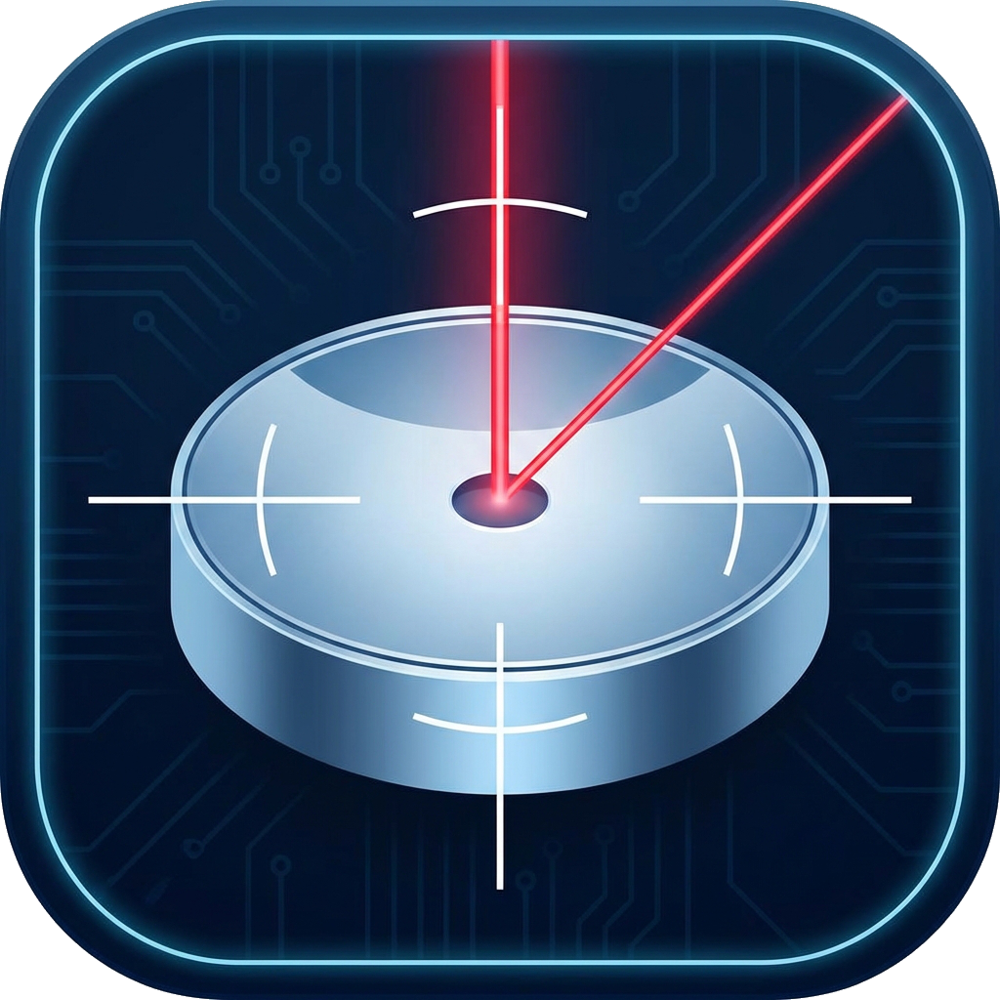

# pyCol - Optical Collimation Tool

**DISCLAIMER:** This software is provided "as-is" without any warranty. Use it at your own risk. The author is not responsible for any damage to your equipment.

---

<p align="center">
  <em>This is a hobby project. If you find it useful and would like to support a good cause, consider donating via <strong>betterplace.org</strong>—all donations go directly to <strong>Doctors Without Borders</strong>.</em><br><br>
  <a href="https://www.betterplace.org/de/fundraising-events/55631-diyastro-for-doctors-without-borders">
    
  </a>
</p>

---

<p align="center">
  
</p>

## Features

- **Live Camera View** - Video feed with adjustable exposure and focus.
- **Overlay System** - Circles and crosshairs with customizable colors and Global Offset for alignment.
- **Plugin System** - Centroid detection and circle fitting to find the optical center.
- **Telescope Profiles** - Save and load configurations for different telescopes (Camera + Overlays + Plugins).
- **Digital Zoom** - Zoom and pan support.
- **Settings Persistence** - Settings are saved per plugin and profile.
- **Dark Mode** - Dark UI theme for night use.

## 📥 Installation

> **Platform Support:** pyCol is designed for Windows and Linux.

### 🪟 Windows
1. Download the latest `pyCol_Setup_x.x.x.exe` from [Releases](../../releases)
2. Run the installer or use the portable `pyCol.exe`.

### 🐧 Linux
Download the `pyCol-x86_64.AppImage` from [Releases](../../releases).
1. Make the file executable: `chmod +x pyCol-x86_64.AppImage`
2. Run it! No installation required.

---

## 📖 Usage Guide

### 1. Camera & Image
*   **Select Camera**: Choose the device from the dropdown. 
*   **Image Adjustment**: Use Contrast, Brightness, and Saturation sliders as needed.
*   **Flip/Mirror**: Adjust the image orientation to match the physical perspective.
*   **Focus Favorites**: 
    *   **Save**: Right-click on the Focus slider or the gray range bar and select **Add position to favorites**.
    *   **Jump**: Left-click on any star icon on the range bar to move the focus to that stored position.
    *   **Delete**: Right-click on a star icon to remove that favorite.
    *   *Note: Favorites are kept between sessions (Global) and can be saved specifically per telescope in a Profile.*

### 2. Telescope Profiles
*   **Save**: Enter a name and click **Save Config**. Stores camera settings, overlays, and plugin parameters.
*   **Load**: Select a profile and click **Load Selected**.
*   **Default Profile**: Click **Set Default** to load a specific profile automatically on startup.

### 3. Overlays & Global Offset
*   **Add Overlays**: Create Circles, Crosshairs, or Radial patterns.
*   **Properties**: Set Color, Thickness, and Radius per overlay.
*   **Global Offset**: Shift all overlays at once to align the digital center with a physical reference.

### 4. Plugins
*   **Offset Measurement**:
    1.  Enable "Live Detection" and adjust the **Threshold**.
    2.  Move the spot around the field and click **Start Auto-Calibration**.
    3.  Collect data points and click **Finish & Solve** to calculate the center.

---

## Snapshot Features

Capture the view with burnt-in metadata.

### Paths & Formatting
The date and time format can be customized using Python's `strftime` codes.

| Code | Description | Example |
|------|-------------|---------|
| `%Y` | Year | 2025 |
| `%m` | Month | 01 |
| `%d` | Day | 25 |
| `%H` | Hour | 15 |
| `%M` | Minute | 30 |
| `%S` | Second | 00 |

### Folders & Filenames
Snapshots can be organized into subfolders based on patterns.

**Available Variables:**

| Variable | Description | Example |
| :--- | :--- | :--- |
| `{profile}` | Active telescope profile name | `Newton 200mm` |
| `%Y-%m-%d` | Date | `2025-01-25` |
| `%H-%M-%S` | Time | `15-30-00` |

**Example Patterns:**
*   `{profile}/%Y-%m-%d` &rarr; `...\pyCol\Newton 200mm\2025-01-25\image.png`
*   `{profile}_%H-%M-%S` &rarr; `Newton 200mm_15-30-00.png`

---

<details>
<summary>Technical Info: Requirements & Building</summary>

### Prerequisites
 pyCol is written in **Python 3.10+**.

| Package | Version |
|---------|---------|
| Python | ≥ 3.10 |
| PySide6 | ≥ 6.6.0 |
| OpenCV | ≥ 4.8.0 |
| NumPy | ≥ 2.0.0 |

### 🐧 Running from Source
```bash
# Clone the repository
git clone https://github.com/DIYAstro/pyCol.git
cd pyCol

# Install dependencies
pip install -r requirements.txt

# Run the application
cd src
python main.py
```

### 🔧 Advanced: Build Scripts
The project uses custom scripts to create releases:
- `build_win_exe.bat`: Creates a standalone Windows EXE.
- `build_win_installer.bat`: Creates an Inno Setup installer.
- `scripts/build_appimage.sh`: (Linux) Packages the app into an AppImage.

Version info is managed centrally in `versioninfo.json`.

</details>

---

## 📄 License

This project is licensed under the **GNU General Public License v3.0** - see the [LICENSE](LICENSE) file for details.

---

## 🤝 Contributing

Contributions are welcome! Please feel free to submit issues or pull requests.
